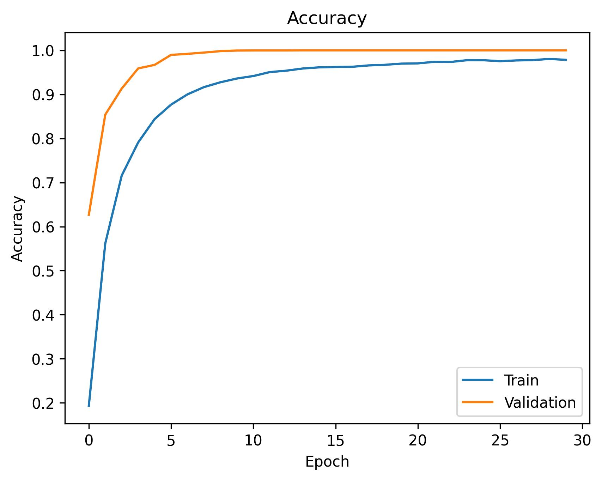

# Sign Language Classifier
**Author**: Duncan Greene

This is a Sign Language Classifier implemented in Python for **COMS 4701 - Artificial Intelligence** at Columbia University

## Overview
- This project involved training a *Convolutional Neural Network (CNN)* using **TensorFlow** and **Keras** to model a classifier for sign language recognition. The training and testing data is provided in `train.csv` and `test.csv` in [this google drive folder](https://drive.google.com/drive/u/0/folders/1DxbyfpckcII5Q0dSBKzoboiArjtE4lKz).
- Each data point is a 28 x 28 pixel greyscale image of a hand, examples of which are visualized below:

    

## Training the Model
- The `create_model` function defines a convolutional neural network (CNN) for classifying the data into one of 26 classes (letters of the alphabet). The input layer accepts 28 x 28 pixel 1 channel images (grayscale).
- Next, there are two *Conv2D* layers with *ReLU* activation for feature extraction, each followed by *MaxPooling2D* for downsampling. The model uses a fully connected Dense layer with 128 neurons for high-level feature learning, a Dropout layer to prevent overfitting, and an output layer with 26 neurons and a softmax activation function to produce class probabilities.
- The model is compiled with the Adam optimizer and Categorical Crossentropy (CCE) loss.
- The prepare_data function normalizes pixel values to the range [0, 1] and reshapes images for compatibility with the CNN.
- Labels are one-hot encoded into 26 classes.
- The dataset is split into training and testing sets using a random seed. The prepared data is stored for model training and evaluation.
- After training the model for 30 epochs, samples of the data and training accuracy are visualized.

## Accuracy
- The model achieves an average test accuracy of approximately 92% when evaluated on test data with randomized seed splits.
- The training and validation accuracy trends over multiple epochs are visualized in the following graph:

    

## Usage
1. Install required dependencies: `pip install numpy pandas matplotlib scikit-learn keras tensorflow`.
2. Ensure you have the necessary csv file datasets, examples are provided [here](https://drive.google.com/drive/u/0/folders/1DxbyfpckcII5Q0dSBKzoboiArjtE4lKz).
3. Run the script: `python sign_language.py`.

***OR IF USING JUPYTER NOTEBOOK***:
1. Open the notebook `jupyter notebook sign_language.ipynb`.
2. Run the cells sequentially.

## Files
- `accuracy.jpg`: A plot showing accuracy over multiple epochs on a random seed.
- `examples.jpg`: examples of data from `train.csv` visualized.
- `sign_language.ipynb`: Jupyter notebook containing the CNN implementation.
- `sign_language.py`: Python script containing the CNN implementation.

